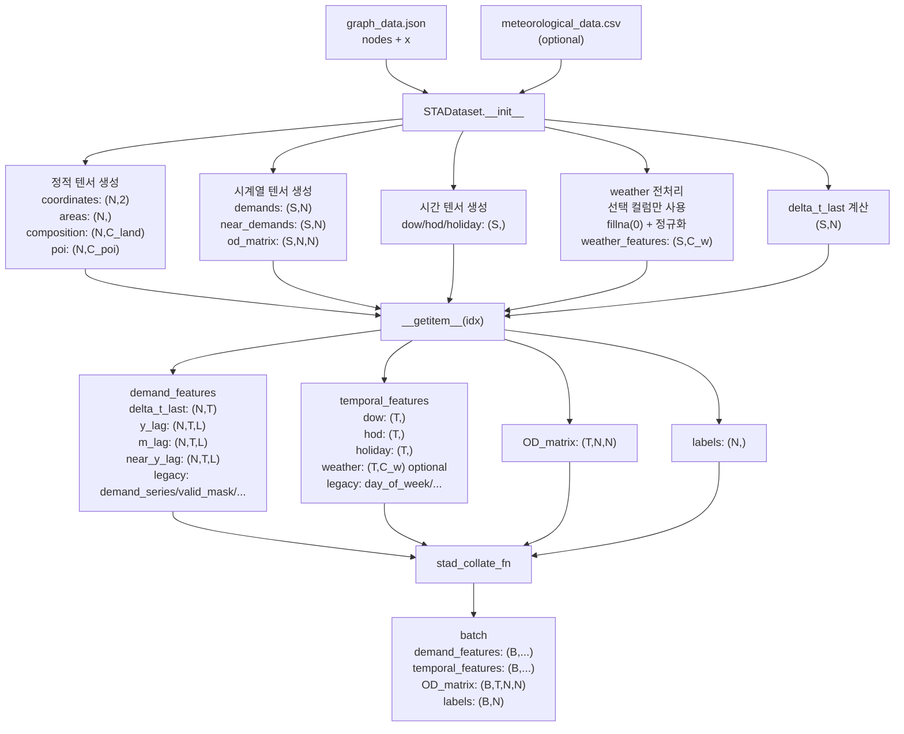

# STANet 현재 코드 분석 + Mermaid 시각화

이 문서는 현재 저장소 코드 기준으로 데이터가 어떤 형태로 들어오고, 각 모듈이 어떤 역할을 하며, 어떤 shape를 출력하는지 정리한 분석서다. 논문 설명이 아니라 현재 구현된 코드 경로를 기준으로 적었다.

## 표기

| 기호 | 의미 | 기본값 / 비고 |
| --- | --- | --- |
| `S` | 전체 시계열 길이 | `len(data["x"])` |
| `N` | 지역(노드) 수 | `len(data["nodes"])` |
| `T` | 입력 시퀀스 길이 | `config.dataset.time_step`, 기본 `7` |
| `L` | lag window 길이 | 현재 코드 경로에서는 사실상 `L = T` |
| `B` | 배치 크기 | train 기본 `30`, diff 기본 `60` |
| `C_land` | land-use feature 수 | 데이터에서 추출 |
| `C_poi` | POI category 수 | 데이터에서 추출 후 `build_model`에서 override |
| `C_w` | weather feature 수 | weather off면 `0`, on이면 기본 `4` |
| `D_t` | TemporalContextEncoder 출력 차원 | 기본 `16` |
| `D_r` | StaticRegionEncoder 출력 차원 | 기본 `32` |
| `D_d` | DynamicDemandEncoder 출력 차원 | 기본 `32` |
| `D` | STANet 공통 hidden 차원 | 기본 `64` |
| `L_gru` | GRU layer 수 | 기본 `2` |

중요한 구현 메모:

- 현재 `STADataset`은 lag window를 별도 인자로 받지 않고 `time_step`으로 lag를 만든다. 그래서 `y_lag`, `m_lag`, `near_y_lag`의 마지막 차원은 현재 코드에서 `L=T`다.
- `STANet.forward()`는 `OD_matrix`를 인자로 받지만, 현재 실제 spatial attention 경로에서는 사용하지 않는다.
- 코드에는 구버전 호환 alias가 아직 남아 있다. 예: `event_prob`, `prediction`, `day_of_week`, `deactivation_period`.

---

## 1. 데이터 로더

### 역할

`STADataset`은 raw JSON/CSV를 읽어서:

- 정적 지역 정보: 좌표, 면적, land-use, POI
- 동적 수요 정보: demand, near_demand, lag window, recency
- 시간 컨텍스트: 요일, 시간, 공휴일, 선택적 날씨
- spatial 보조 정보: 시점별 `OD_matrix`

를 만들어 `Trainer`가 바로 받을 수 있는 batch dict로 바꾼다.

### Mermaid

### 실제 배치 shape

| 항목 | shape |
| --- | --- |
| `demand_features["delta_t_last"]` | `(B, N, T)` |
| `demand_features["y_lag"]` | `(B, N, T, L)` |
| `demand_features["m_lag"]` | `(B, N, T, L)` |
| `demand_features["near_y_lag"]` | `(B, N, T, L)` |
| `demand_features["demand_series"]` | `(B, N, T)` |
| `demand_features["valid_mask"]` | `(B, N, T)` |
| `temporal_features["dow"]` | `(B, T)` |
| `temporal_features["hod"]` | `(B, T)` |
| `temporal_features["holiday"]` | `(B, T)` |
| `temporal_features["weather"]` | `(B, T, C_w)` |
| `OD_matrix` | `(B, T, N, N)` |
| `labels` | `(B, N)` |

---

## 2. STA-Net 전체적인 흐름

이 파트에서는 각 모듈 내부는 블랙박스로 두고, 텐서가 어떻게 흐르는지만 본다.

### Mermaid

```mermaid
flowchart LR
    A["demand_features<br/>(B,N,T/L)"] --> B["DynamicDemandEncoder"]
    C["temporal_features<br/>(B,T) or (B,T,C_w)"] --> D["TemporalContextEncoder"]
    E["정적 지역 정보<br/>x_land: (N,C_land)<br/>x_geo: (N,3)<br/>x_poi: (N,C_poi)"] --> F["StaticRegionEncoder"]

    D --> F
    D --> G["u_time expand<br/>(B,T,D_t) -> (B,N,T,D_t)"]
    B --> H["u_dyn<br/>(B,N,T,D_d)"]
    F --> I["u_reg<br/>(B,N,T,D_r)"]
    G --> J["concat<br/>(B,N,T,D_r+D_t+D_d)"]
    H --> J
    I --> J

    J --> K["Linear + ReLU<br/>e_seq: (B,N,T,D)"]
    K --> L["for each t=1..T"]
    L --> M["TemporalStateUpdater.gated_fusion<br/>s_t: (B,N,D)"]
    M --> N["SnapshotGlobalAttention<br/>z_t: (B,N,D)"]
    N --> O["TemporalStateUpdater.gru_update<br/>h_t: (B,N,D)"]
    O --> P["stack over time<br/>h_seq: (B,N,T,D)"]
    P --> Q["TemporalWindowAggregator<br/>state: (B,N,D)"]
    Q --> R["Event head + Sigmoid<br/>p_event: (B,N)"]
    Q --> S["Magnitude head + Softplus<br/>y_hat_pos: (B,N)"]
    R --> T["optional PTReLU"]
    T --> U["y_hat = gate * y_hat_pos<br/>(B,N)"]
    S --> U

    V["OD_matrix<br/>(B,T,N,N)"] -. "현재 코드에서는 전달만 되고 사용되지 않음" .-> N
```

### 흐름 요약

| 단계 | 입력 | 출력 | 역할 |
| --- | --- | --- | --- |
| TemporalContextEncoder | `(B,T)` 또는 `(B,T,C_w)` | `(B,T,D_t)` | 시간 컨텍스트 인코딩 |
| StaticRegionEncoder | 정적 지역 정보 + `u_time` | `(B,N,T,D_r)` | 지역별 정적 표현 생성 |
| DynamicDemandEncoder | 수요 lag/recency 정보 | `(B,N,T,D_d)` | 지역-시점별 동적 표현 생성 |
| Initial fusion | `u_reg`, `u_time`, `u_dyn` | `(B,N,T,D)` | 통합 임베딩 생성 |
| TemporalStateUpdater + Snapshot attention loop | `e_seq[:, :, t, :]` | 각 시점 `h_t: (B,N,D)` | 시계열 상태 업데이트 + 시점별 spatial mixing |
| TemporalWindowAggregator | `(B,N,T,D)` | `(B,N,D)` | 시간축 요약 |
| Output heads | `(B,N,D)` | `(B,N)` | 발생 확률 / 발생 시 크기 / 최종 수요 예측 |

---

## 3. 각 모듈 설명

### Mermaid

```mermaid
flowchart TD
    subgraph M1["POIEncoder"]
        M1I["x_poi: (N,C_poi)<br/>temporal_context: (B,T,D_t) optional"] --> M1O["poi_feat: (B,N,T,C_poi)<br/>or poi_static: (N,C_poi)"]
    end

    subgraph M2["StaticRegionEncoder"]
        M2I1["x_land: (N,C_land)"]
        M2I2["x_geo: (N,3)"]
        M2I3["POIEncoder output"]
        M2I4["temporal_context: (B,T,D_t)"]
        M2I1 --> M2O["u_reg: (B,N,T,D_r)"]
        M2I2 --> M2O
        M2I3 --> M2O
        M2I4 --> M2O
    end

    subgraph M3["TemporalContextEncoder"]
        M3I1["dow: (B,T)"]
        M3I2["hod: (B,T)"]
        M3I3["holiday: (B,T)"]
        M3I4["weather: (B,T,C_w) optional"]
        M3I1 --> M3O["u_time: (B,T,D_t)"]
        M3I2 --> M3O
        M3I3 --> M3O
        M3I4 --> M3O
    end

    subgraph M4["DynamicDemandEncoder"]
        M4I1["y_lag: (B,N,T,L)<br/>or demand_series: (B,N,T)"]
        M4I2["m_lag: (B,N,T,L)<br/>or valid_mask: (B,N,T)"]
        M4I3["delta_t_last: (B,N,T)<br/>or deactivation_period"]
        M4I4["near_y_lag: (B,N,T,L) optional"]
        M4I1 --> M4O["u_dyn: (B,N,T,D_d)"]
        M4I2 --> M4O
        M4I3 --> M4O
        M4I4 --> M4O
    end

    subgraph M5["SnapshotGlobalAttention"]
        M5I1["snapshot_state: (B,N,D)"] --> M5O["z_t: (B,N,D)"]
        M5I2["OD / attn_bias interface exists"] -.-> M5O
    end

    subgraph M6["TemporalStateUpdater"]
        M6I1["e_t: (B,N,D)"]
        M6I2["h_prev_top: (B,N,D)"]
        M6I3["h_prev: (L_gru,B*N,D)"]
        M6I1 --> M6O["h_t: (B,N,D)<br/>h_new: (L_gru,B*N,D)"]
        M6I2 --> M6O
        M6I3 --> M6O
    end

    subgraph M7["TemporalWindowAggregator"]
        M7I["h_seq: (B,N,T,D)"] --> M7O["state: (B,N,D)"]
    end

    subgraph M8["Output Heads"]
        M8I["state: (B,N,D)"] --> M8O1["p_event: (B,N)"]
        M8I --> M8O2["y_hat_pos: (B,N)"]
        M8O1 --> M8O3["y_hat: (B,N)"]
        M8O2 --> M8O3
    end
```

### 모듈별 설명 표

| 모듈 | 입력 | 출력 | 역할 | 구현상 메모 |
| --- | --- | --- | --- | --- |
| `POIEncoder` | `x_poi: (N,C_poi)`, `temporal_context: (B,T,D_t)` optional | `(B,N,T,C_poi)` 또는 `(N,C_poi)` | POI 존재/규모를 가중합해 지역 특성으로 변환 | `activate=false`면 0 텐서 반환 |
| `StaticRegionEncoder` | `x_land`, `x_geo`, `POIEncoder output`, `temporal_context` | `(B,N,T,D_r)` | 정적 지역 표현 `u_reg` 생성 | 현재 `x_geo`는 `[normalized lat, normalized lon, log1p(area)]` |
| `TemporalContextEncoder` | `dow`, `hod`, `holiday`, optional `weather` | `(B,T,D_t)` | 시간적 문맥 표현 `u_time` 생성 | 요일/시간 임베딩과 holiday vector를 더함 |
| `DynamicDemandEncoder` | `y_lag`, `m_lag`, `delta_t_last`, optional `near_y_lag` | `(B,N,T,D_d)` | 과거 수요, 결측/패딩 마스크, recency를 동적 표현으로 압축 | 현재 기본 경로에서는 `y_lag`가 이미 `(B,N,T,L)`로 들어옴 |
| `SnapshotGlobalAttention` | `snapshot_state: (B,N,D)` | `(B,N,D)` | 같은 시점의 모든 지역을 attention으로 섞음 | 인터페이스에 `OD`가 있지만 현재 구현은 사용하지 않음 |
| `TemporalStateUpdater` | `e_t`, `h_prev` | `s_t`, `g_t`, `h_t`, `h_new` | gate와 GRU로 시간 상태 업데이트 | STANet 본체에서는 `gated_fusion()`과 `gru_update()`를 직접 호출 |
| `TemporalWindowAggregator` | `h_seq: (B,N,T,D)` | `state: (B,N,D)` | 시간축 attention pooling | constructor로 `nhead` 등을 받지만 현재 forward에서는 사용하지 않음 |
| `PTReLU` | `p_event: (B,N)` | `(B,N)` | 작은 확률을 더 강하게 누르는 gating | `config.model.PTReLU.use`로 on/off |
| `STANetForTrainer` | 모델 출력 + `labels: (B,N)` | `loss`, `logits`, alias outputs | Hugging Face Trainer용 loss 계산 | 출력 alias key를 함께 반환 |

### 모듈 연결 관점에서 본 핵심 포인트

1. `u_time`은 먼저 `(B,T,D_t)`로 계산된 뒤, `(B,N,T,D_t)`로 broadcast되어 다른 모듈 출력과 concat된다.
2. `u_reg`와 `u_dyn`는 둘 다 이미 지역축 `N`과 시간축 `T`를 가진다.
3. spatial attention은 전체 시퀀스에 한 번에 적용되지 않고, `for t in range(T)` 루프 안에서 시점별로 `(B,N,D)`에 대해 수행된다.
4. temporal aggregation은 마지막 hidden 하나를 쓰지 않고 `h_seq: (B,N,T,D)` 전체를 attention pooling한다.
5. 현재 코드에서 `OD_matrix`는 dataloader까지는 잘 만들어지지만, 실제 spatial attention score에는 반영되지 않는다.

---

## 코드 기준 위치

- 데이터 로더: `/dataset_frame/sta_dataset.py`
- 모델 본체: `/models/sta_net.py`
- 학습 wrapper: `/models/train_model.py`
- 모듈:
  - `/models/module/regeon_encoder.py`
  - `/models/module/temporal_encoder.py`
  - `/models/module/local_lag_encoder.py`
  - `/models/module/snapshot_global_attn.py`
  - `/models/module/temporal_state_module.py`
  - `/models/module/temporal_aggregation.py`
